# CSNePS - Concurrent SNePS

CSNePS is an implementation and extension of the [SNePS 3](http://www.cse.buffalo.edu/sneps/Projects/sneps3.html) knowledge representation and reasoning system specification. CSNePS, designed to leverage concurrency during inference, is crafted in the Clojure programming language.

For a deeper understanding of usage, consult our [user manual](./doc/manual/manual.pdf) and [GUI manual](./doc/SNePSGUIDocs.pdf).

The original repository is hosted on GitHub, accessible [here](https://github.com/SNePS/CSNePS).

## Download and Run CSNePS

First of all, you need to have Java installed on your system. You can download the latest version of Java from [here](https://www.java.com/en/download/).

You can download the latest release of CSNePS directly from the GitHub repository. 

1. Navigate to the [releases page](https://github.com/SNePS/CSNePS/releases) of the CSNePS repository.
2. Download the zip file for the latest release, e.g., `CSNePS-1.0.0.zip`.
3. Unzip the downloaded file.

To run CSNePS, use the provided `.sh` or `.bat` files (for Unix-based or Windows systems respectively):

- To launch the GUI mode:
   - Unix-based systems: `./run-gui.sh`
   - Windows systems: `run-gui.bat`
   
- To launch the console mode:
   - Unix-based systems: `./run-console.sh`
   - Windows systems: `run-console.bat`
   
These scripts execute the command `java -jar` with the appropriate CSNePS JAR file and parameters.

## GUI guide

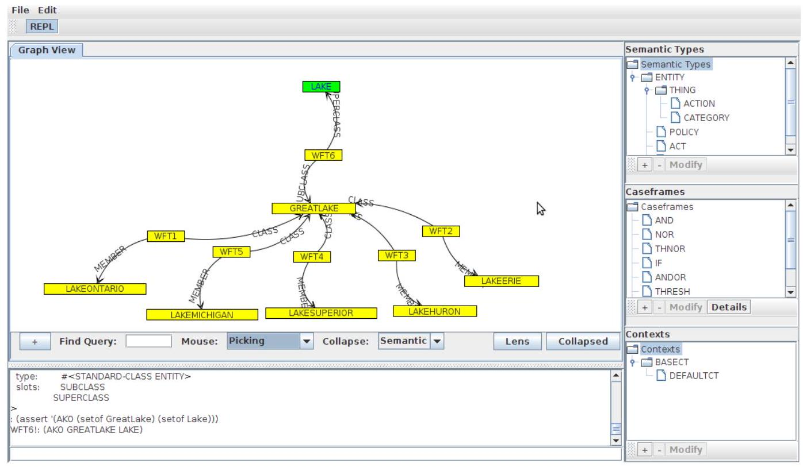


### File Operations

#### Loading a Knowledge Base

To load a knowledge base, click the File menu, then Load, then "Load to KB." After selecting a file and clicking "Open" the file will be loaded into the SNePS 3 knowledge base. The REPL can be used to view what has been loaded and any feedback from SNePS 3.

#### Loading a Demo

To load a demo click File $->$ Load $->$ Demo. Select the demo file and click open. The demo window will appear.

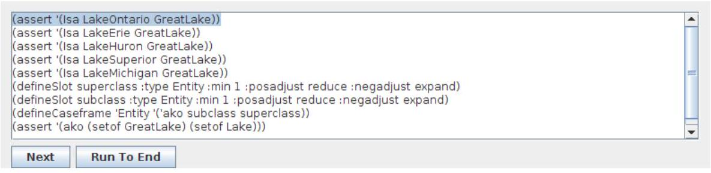

Click Next to execute the next line of the demo, or Run to End to execute the entire demo up to and including the last line.

#### Saving a Knowledge Base

To save the current knowledge base click File $->$ Save $->$ Current KB. This will save all definitions of semantic types, caseframes, and slots along with all assertions since the last time the knowledge base was cleared.

#### Creating a Demo

To create a demo you need only follow through the steps you wish to be in the demo, then click File $->$ Save $->$ Demo. This will save the entire contents of the knowledge base since you started.

#### Saving a PNG of the Graph

To save a JPEG the user clicks File, then Save, followed by Graph as PNG. After selecting where the file should be stored the file is saved. Note that the currently visable part of the graph is saved, not the entire graph.

PNG is a nearly lossless format, and is therefore better than JPEG for uses on the web and for publications. 

### Working with SNePS

#### Clearing the Knowledge Base

To clear the knowledge base click the SNePS menu, then Clear Knowledge Base from the menu.

#### Adding a Semantic Type

To add a semantic type, click the "+" button under the Semantic Type tree on the right side of the main user interface panel. The "Define Semantic Type" window then appears.

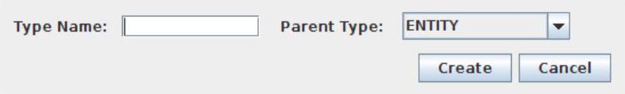

You can then enter a name for the type and choose the parent of the type. Finally click the "Create" button to finish creating the type.

Note that currently the interface only allows choosing one parent, while SNePS itself allows choosing more than one. This will be changed in a future release.

#### Switching Contexts

To switch contexts, select the appropriate context from the context tree on the right side of the main interface panel.

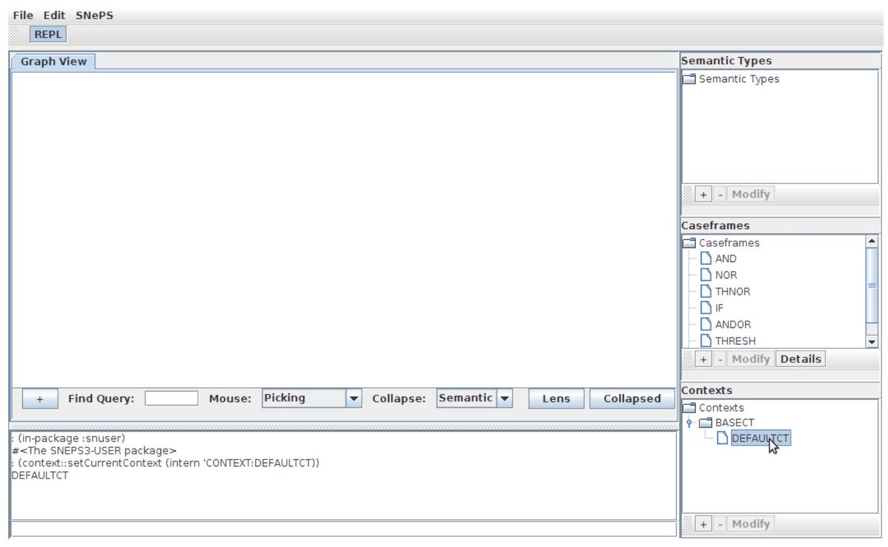


#### Adding a Context

To create a context, click the "+" button under the Contexts tree on the right side of the main user interface panel. The "Define Context" window then appears.

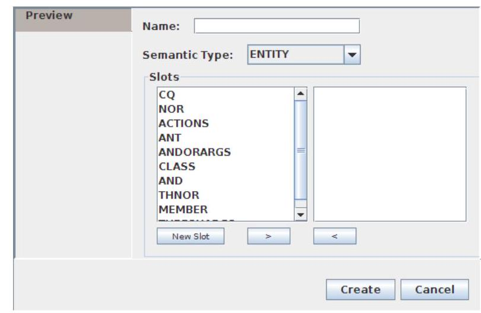

Fill in a new context name, the parent of the context, and a space delimited set of assertions to be included in this context. When you have completed this, click "Create."

#### Adding Slots and Caseframes

To create a casefreame, click the "+" button under the Caseframes tree on the right side of the main user interface panel. The "Define Casefreame" window then appears.

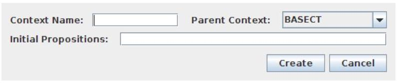

To create a caseframe enter an appropriate name for the caseframe, and select the appropriate semantic type. Next, add the slots which will be in this caseframe by selecting them in the left list and clicking the ">" button. Slots which have been added to the right list are added to the caseframe, while those in the left list are those which will not been added. You may remove an item from the right pane by selecting it and clicking the "<" button.

Note that the order of the slots in the right pane is important. The order in which the slots are added from the left selection box to the right box is the order they will be in the SNePS defineCaseframe statement. The area this will most affect the user is if these are added backwards in a binary relation then the collapsed graph will have backwards directed edges.

If a slot you wish to add is not listed you will have to create it. This is done by clicking the "New Slot" button. The Define Slot window will appear. 

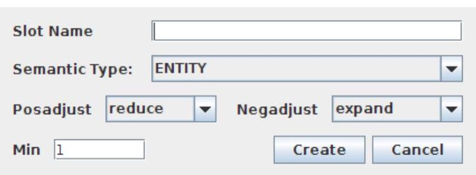

Fill in the appropriate values and click "Create." (See the SNePS 3 user manual for a description of what these options do, if needed.) The new slot will be added to the left selection list of the Define Caseframe window.

Note that after creating a caseframe you are able to see which slots are part of it by selecting it in the caseframe tree in the main user interface and clicking the "Details" button.

#### Interacting with SNePS Directly

If you wish to perform operations not supported by the user interface, or you find the interface cumbersome, you may use the REPL provided to interact with SNePS directly. Simply enter the command you wish into the REPL text box and press Enter. Note that the output displayed here is only the value returned by a command, not anything which uses the lisp format command.

### Using the Graph View

The graph is created automatically when terms are added to the SNePS knowledge base. This section will assist you in manipulating the graph.

#### Adding Nodes to the Graph

When adding nodes to the graph the user adds an instance of a caseframe. To do this, click the "+" button under the graph visualization, a new window will appear.

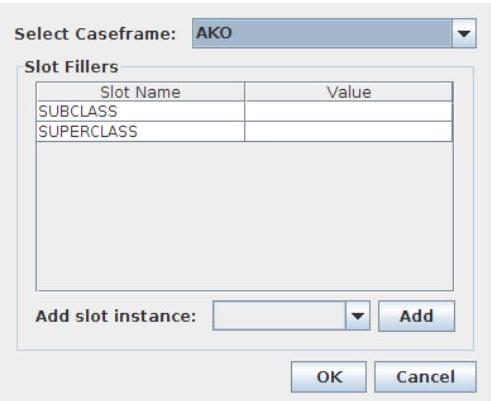

First, select the caseframe which you wish to add to the graph. A list of fillers required for this caseframe appears. Double-click the value field of each filler to enter the value you wish. If you are working with a caseframe which has slots which allow for more than one filler, you may add those fillers by selecting it from the "Add slot instance" drop down and clicking "Add." When you are done, click "OK" to add the assertion to the Knowledge Base and to the graph.

#### Basic Graph Manipulation

The JUNG graph visualization toolkit which is in use here defines two modes for dealing with the graph - picking and transforming. These two options are selectable from the "Mouse" drop down box under the graph visualization window. Picking means the ability to select a single node and move it, while in the transforming mode clicking and dragging movies the entire graph.

Also, the user may zoom in to or out from the graph using the mouse wheel.

#### Collapsing the Graph

To collapse nodes using the "Semantic Collapse" method which eliminates WFT nodes from binary relations and draws arcs labeled with the relation name, click the "Collapsed" button under the graph visualization pane. In order to return to the expanded view click this button again.

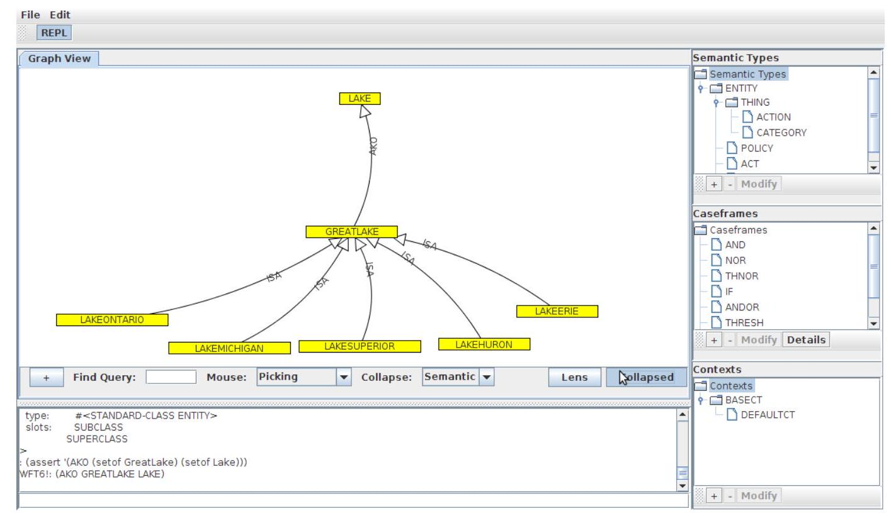

#### Using a Hyperbolic Lens

As a method to selectively zoom into a tightly clustered place in the graph you may activate a hyperbolic lens. To do this, click the "Lens" button under the graph visualization window. 

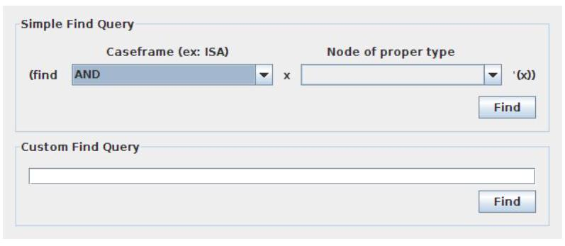

The lens can be dragged when the graph is in Transforming mode. It can also be resized by clicking and dragging its edge when in this mode. To disable the lens, click the button used to activate it again.

#### Using a Find Query

You can use the find function in SNePS 3 to find a set of nodes of a certain type. In order to do this click in the text box next to the word "Find" under the graph visualization panel. The find window appears.

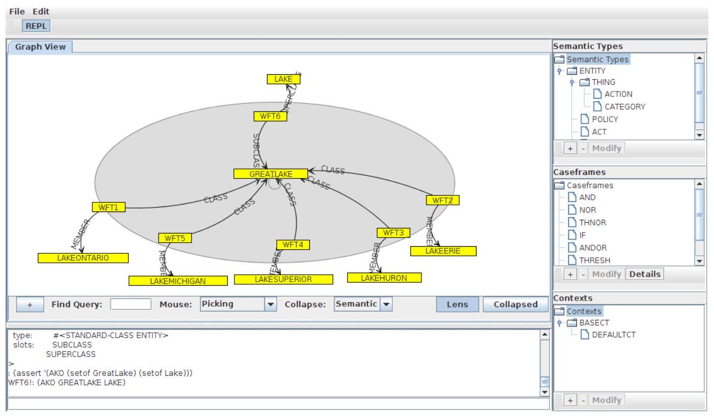

Two options are presented in this window. A simple find query can be used to find all assertions which have the selected caseframe, then a variable, and a node of a type. Alternatively the user can enter a custom find query.

The results of this are then displayed in the graph area, hiding all of the nodes which are not relevant. To exit the find mode click the "Exit Find Mode" button at the top of the graph area.

Note that this area will be redesigned in a future release to be more user friendly.

## Basic SNePS 3 syntax

### Explaining the first demo
You can find the first demo in the file `basic-demo.sneps`. This file contains the following code:

```lisp
;;; Basic Demo of CSNePS Facilities
;;; ================================

;;; The contents of this file are subject to the University at Buffalo
;;; Public License Version 1.0 (the "License"); you may not use this file
;;; except in compliance with the License. You may obtain a copy of the
;;; License at http://www.cse.buffalo.edu/sneps/Downloads/ubpl.pdf.
;;; 
;;; Software distributed under the License is distributed on an "AS IS"
;;; basis, WITHOUT WARRANTY OF ANY KIND, either express or implied. See
;;; the License for the specific language governing rights and limitations
;;; under the License.
;;; 
;;; The Original Code is CSNePS.
;;; 
;;; The Initial Developer of the Original Code is Research Foundation of
;;; State University of New York, on behalf of University at Buffalo.
;;; 
;;; Portions created by the Initial Developer are Copyright (C) 2007
;;; Research Foundation of State University of New York, on behalf of
;;; University at Buffalo. All Rights Reserved.
;;; 
;;; Contributor(s): ______________________________________.

(in-ns 'csneps.core.snuser)
;; Initialize KB completely
(clearkb true)
;;; Initial set of semantic types
(showTypes)
;;; Initial set of contexts
(listContexts)
;;; The current context
(currentContext)
;;; Can use Propositional Logic
;;; ===========================
;;; Assert p
(assert 'p)
;;; Query p
(ask 'p)
;;; Go to a new child context
(setCurrentContext (defineContext 'CT2 :parents '(DefaultCT)))
;;; Assert q in this context
(assert 'q)
;;; See terms
(list-terms)
;;; Go to a sibling context
(setCurrentContext (defineContext 'CT3 :parents '(DefaultCT) :hyps '(r)))
;;; See the terms here
(list-terms)
;;; Query some terms
(ask 'p)
(ask 'q)
(ask 'r)
;;;
;;; Predicate Logic
;;; ===============
;;; Reinitialize
(clearkb true)
;;; Initial set of slots
(list-slots)
;;; Initial set of caseframes
(list-caseframes)
;;; Terms can be symbols, strings, or numbers
(assert '(Isa Fido Dog))
(assert '(Isa "Lake Erie" Lake))
(assert '(Isa 3 Integer))
(assert '(Isa 3.1415932 Transcendental))
;;; A term can also be a wft name
(assert '(Isa wft17 Proposition))
;;; Type of input term is irrelevant
(assert '(Isa "3" Integer))
;;; *PRECISION* determines round-off of floating point numbers
*PRECISION*
(assert '(Isa 3.1415943219 Transcendental))
;;; Reinitialize
(clearkb)
;;; Set arguments
(assert '(Isa (setof Fido Rover) Dog))
;;; Sets can be written two ways
(assert '(Isa #{Rover Fido} Dog))
;;; A bigger set is different
(assert '(Isa (setof Fido Rover Lassie) Dog))
;;; A smaller set is different
(assert '(Isa (setof Fido) Dog))
;;; A single argument is the same as a singleton
(assert '(Isa Fido Dog))
;;; Now let's see all the terms
(list-terms)
;;; Let's see just the asserted terms.
(list-terms :asserted true)
;;; and describe the asserted ones.
(describe-terms wft19 wft17 wft18)
;;;
;;; A caseframe with unquoted function symbol
;;;
(clearkb true)
(defineType Action (Thing) "The category of actions")
(defineSlot object :type Thing
		:docstring "The object argument of an act."
		:posadjust none :negadjust none
		:min 1 :max 1)
;;; Note that the actions slot is predefined.
(defineCaseframe 'Act '(action object)
  :docstring "[action] [object]"
  :fsymbols '(senseFor go))
(assert '(Isa (senseFor smell) Act))
(assert '(Isa (go left) Act))
(sameFrame 'say 'go)
(assert '(Isa (say Hello) Act))
(list-terms)
(describe-terms wft19 wft21 wft23)
;;;
;;; Negations
;;;
(clearkb true)
(assert '(not (Isa Fido Cat)))
(assert '(nor (Isa Fluffy Dog) (Isa Tweety Penguin) (Isa Rover Cat)))
(list-terms)
;;;
;;; Violating the min/max slot restrictions
;;;
(clearkb true)
(assert '(Equiv (setof Superman "Clark Kent")))
(assert '(Equiv UniqueMan))
(defineSlot min3 :type Entity :min 3)
(defineSlot max3 :type Entity :max 3)
(defineCaseframe 'Proposition '('MinMax min3 max3))
(assert '(MinMax (setof a b) (setof 1 2 3 4)))
(assert '(MinMax (setof a b c) (setof 1 2 3 4)))
(assert '(MinMax (setof a b c) (setof 1 2 3)))
```

Let's go through each segment of the code.

Firstly, the beginning of the file consists of comments which provides some legal information. In Lisp, comments are marked with a semicolon (`;`). The more semicolons, the more significant the comment is conventionally considered.

```lisp
(in-ns 'csneps.core.snuser)
```
This line is changing the namespace to 'csneps.core.snuser'. A namespace is a container that holds a set of identifiers or symbols.

```lisp
(clearkb true)
```
This line is invoking the function `clearkb` with the argument `true`. It's clearing the knowledge base (KB).

```lisp
(showTypes)
(listContexts)
(currentContext)
```
These lines are invoking the functions `showTypes`, `listContexts`, and `currentContext` respectively. They're used to print the semantic types in the KB, list the contexts, and get the current context.

```lisp
(assert 'p)
```
This line asserts the proposition 'p'.

```lisp
(ask 'p)
```
This line queries the KB for the proposition 'p'.

```lisp
(setCurrentContext (defineContext 'CT2 :parents '(DefaultCT)))
```
This line defines a new context 'CT2' with 'DefaultCT' as its parent and sets it as the current context.

```lisp
(assert 'q)
```
This line asserts the proposition 'q'.

```lisp
(list-terms)
```
This line lists all the terms in the current context.

```lisp
(setCurrentContext (defineContext 'CT3 :parents '(DefaultCT) :hyps '(r)))
```
This line defines another new context 'CT3' with 'DefaultCT' as its parent and 'r' as a hypothesis and sets it as the current context.

```lisp
(ask 'p)
(ask 'q)
(ask 'r)
```
These lines are querying the KB for propositions 'p', 'q', and 'r' respectively.

```lisp
(clearkb true)
```
Here again, it's clearing the KB before starting with predicate logic demonstrations.

```lisp
(assert '(Isa Fido Dog))
```
This line is asserting that 'Fido' is a 'Dog'.

```lisp
(assert '(Isa (setof Fido Rover) Dog))
```
This line is asserting that both 'Fido' and 'Rover' are 'Dog'.

```lisp
(defineSlot object :type Thing
		:docstring "The object argument of an act."
		:posadjust none :negadjust none
		:min 1 :max 1)
```
This line defines a slot named 'object' of type 'Thing' with a docstring, no positional adjustment, no negative adjustment, and minimum and maximum cardinality as 1.

```lisp
(defineCaseframe 'Act '(action object)
  :docstring "[action] [object]"
  :fsymbols '(senseFor go))
```
This line defines a case frame named 'Act' with 'action' and 'object' as slots, a docstring, and function symbols 'senseFor' and 'go'.

```lisp
(assert '(Isa (senseFor smell) Act))
```
This line asserts that '(senseFor smell)' is an 'Act'.

```lisp
(assert '(not (Isa Fido Cat)))
```
This line asserts that 'Fido' is not a 'Cat'.

Next block of code is demonstrating what happens when you violate the minimum (`min`) and maximum (`max`) slot restrictions in CSNePS.

Here's a detailed breakdown:

1. `(clearkb true)`: This line clears the knowledge base (KB). This operation is often performed before a new set of operations to ensure that no previous knowledge interferes with the new operations.

2. `(assert '(Equiv (setof Superman "Clark Kent")))`: This line asserts an equivalence between 'Superman' and 'Clark Kent'. In other words, it's stating that Superman and Clark Kent refer to the same entity.

3. `(assert '(Equiv UniqueMan))`: This line asserts that there is a unique man. It doesn't specify who the man is.

4. `(defineSlot min3 :type Entity :min 3)`: This line defines a slot named 'min3' of type 'Entity' and specifies that this slot must have a minimum of 3 entities.

5. `(defineSlot max3 :type Entity :max 3)`: Similarly, this line defines a slot named 'max3' of type 'Entity' and specifies that this slot must have a maximum of 3 entities.

6. `(defineCaseframe 'Proposition '('MinMax min3 max3))`: This line defines a case frame (a specific type of proposition) named 'MinMax' which expects two arguments: one that satisfies the 'min3' slot and another that satisfies the 'max3' slot.

7. The last three `assert` statements are attempting to assert propositions that fill the 'MinMax' case frame:

   - `(assert '(MinMax (setof a b) (setof 1 2 3 4)))`: This statement attempts to assert a 'MinMax' proposition where the first slot is filled with a set of 2 entities ('a' and 'b') and the second slot is filled with a set of 4 entities (1, 2, 3, 4). Since the 'min3' slot requires at least 3 entities and 'max3' slot allows at most 3 entities, this assertion should violate the slot restrictions and fail.
   
   - `(assert '(MinMax (setof a b c) (setof 1 2 3 4)))`: This statement attempts to assert a 'MinMax' proposition where the first slot is filled with a set of 3 entities ('a', 'b', and 'c') and the second slot is filled with a set of 4 entities (1, 2, 3, 4). Since the 'max3' slot allows at most 3 entities, this assertion should violate the slot restrictions and fail.
   
   - `(assert '(MinMax (setof a b c) (setof 1 2 3)))`: This statement attempts to assert a 'MinMax' proposition where both slots are filled with a set of 3 entities. Since this meets the requirements for both 'min3' and 'max3', this assertion should be successful.


### Demo descriptions

| Demonstration Title | File Name |
|---------------------|-----------|
| Demonstration of basic CSNePS functionality. | basic-demo.sneps |
| Example of function-valued functions. | refcl.sneps |
| Demonstration of contextually determining, and changing semantic types. | changedemo.sneps |
| Demonstration of sort-based inference | sort-based-derivable.sneps |
| Demonstration of path-based inference | pb-inference.sneps |
| Demonstration of natural deduction | natural-deduction-derivable.sneps |
| Demonstration of natural deduction with xor | xor.sneps |
| Demonstration of andor and thresh introduction | andor.sneps |
| Demonstration of thresh elimination | threshelim.sneps |
| Demonstration of equivalence elimination and introduction | equivalence.sneps |
| Demonstration of combined slot-based inference and and elimination | inferdemo.sneps |
| Using Slot-Based Inference to derive rules | sbConnectives.sneps |
| Cutting Infinite Recursion | recursion.sneps |
| Negation by Failure | negbyfail.sneps |
| SNeRE | snere.sneps |
| Demonstration of using find (for SNePS Developers). | finddemo.sneps |
| Demonstration of building arbitrary individuals. | vardemo.sneps |
| Demonstration of condition-action rules. | condact-rules.sneps |
| Demonstration of focused inference. | focusedinfer.sneps |
| Demonstration of inference using generics. | genericinfer.sneps |
| Demonstration of subsumption inference. | subsumption.sneps |
| Demonstration of production rules. | production-rules.sneps |
| Demonstration of modeling with krnovice. | dissertation-examples.sneps |


### Contributing
If you made your own example, please share it with us! We would love to see what you have done with CSNePS.

## Compiling CSNePS from Source

CSNePS can be compiled and run using [Leiningen](https://leiningen.org/), providing the best user experience. Please follow the steps below to install Leiningen on various platforms, then use it to compile and run CSNePS.

### Installing Leiningen

#### macOS
1. Install Homebrew, if it's not already installed, by running the following command in Terminal:
   ```sh
   /bin/bash -c "$(curl -fsSL https://raw.githubusercontent.com/Homebrew/install/master/install.sh)"
   ```
2. Use Homebrew to install Leiningen:
   ```sh
   brew install leiningen
   ```

#### Windows
Choose **EITHER** Chocolatey **OR** Scoop for the installation, not both.

1. **Chocolatey**:
   - Open a PowerShell with administrative rights and run:
     ```sh
     Set-ExecutionPolicy Bypass -Scope Process -Force; [System.Net.ServicePointManager]::SecurityProtocol = [System.Net.ServicePointManager]::SecurityProtocol -bor 3072; iex ((New-Object System.Net.WebClient).DownloadString('https://chocolatey.org/install.ps1'))
     ```
   - Install Leiningen:
     ```sh
     choco install lein
     ```

**OR**

2. **Scoop**:
   - Open a PowerShell with administrative rights and run:
     ```sh
     iwr -useb get.scoop.sh | iex
     ```
   - Install Leiningen:
     ```sh
     scoop install leiningen
     ```

#### Linux
1. Use wget to download Leiningen, then make it executable and move it to the appropriate directory:

    ```sh
    wget https://raw.githubusercontent.com/technomancy/leiningen/stable/bin/lein
    chmod +x lein
    sudo mv lein /usr/local/bin
    ```

### Running CSNePS

After installing Leiningen, you can run CSNePS in two ways:

1. Launch CSNePS with its GUI by navigating to the CSNePS directory and running:
   ```sh
   lein run
   ```
2. Launch the command line interface for CSNePS by running:
   ```sh
   lein run -c
   ```

### Compiling CSNePS into a standalone JAR

CSNePS can be compiled into a standalone JAR file using Leiningen. Navigate to the CSNePS directory and type:

```sh
lein uberjar
```

The resulting JAR files will be located in the `target/` directory.