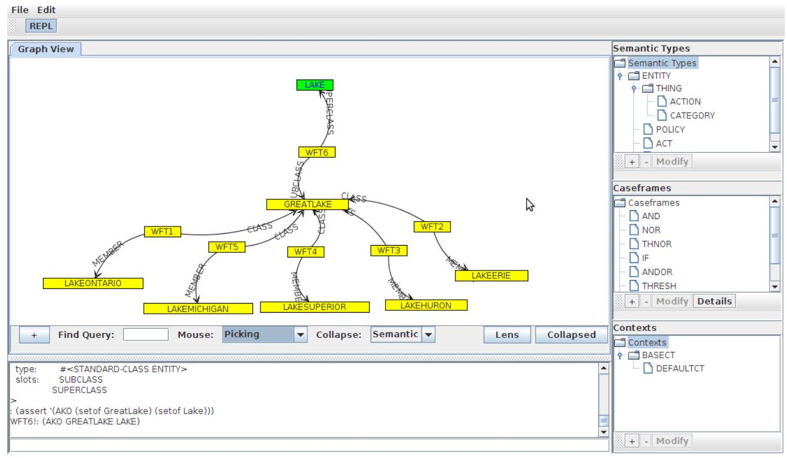
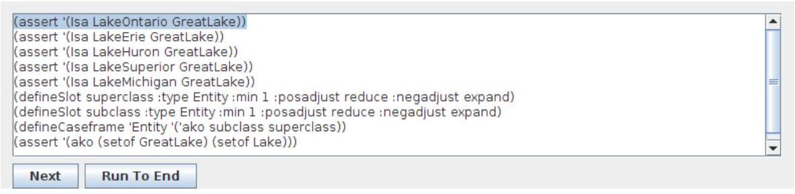
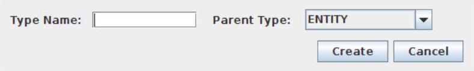
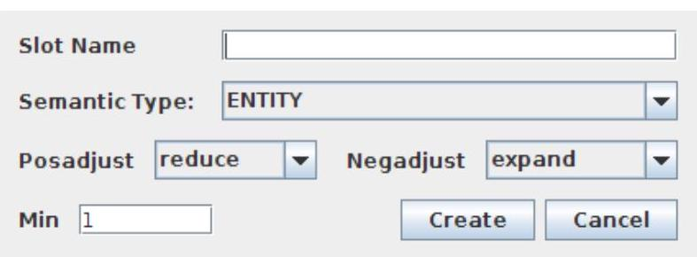
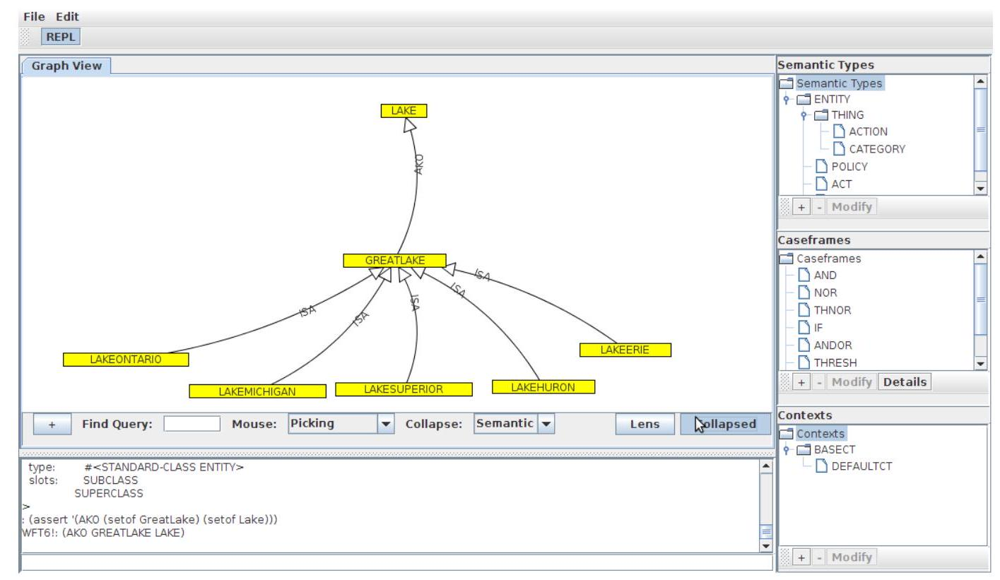
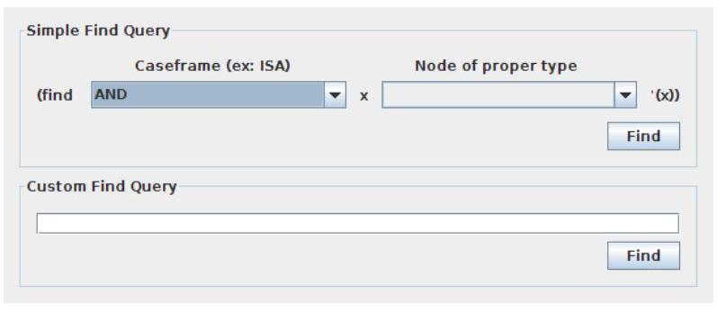

# CSNePS - Concurrent SNePS

### [README (EN)](README.md) | [README (RU)](README_RU.md)

CSNePS - это реализация и расширение спецификации системы представления и рассуждения знаний [SNePS 3](http://www.cse.buffalo.edu/sneps/Projects/sneps3.html). CSNePS, разработанный для использования параллелизма в процессе вывода, создан на языке программирования Clojure.

Для более глубокого понимания использования обратитесь к нашему [руководству пользователя](./doc/manual/manual.pdf) и [руководству по GUI](./doc/SNePSGUIDocs.pdf).

Оригинальный репозиторий размещен на GitHub, доступен [здесь](https://github.com/SNePS/CSNePS).

## Загрузка и запуск CSNePS

Прежде всего, вам нужно установить Java на вашу систему. Вы можете загрузить последнюю версию Java [здесь](https://www.java.com/en/download/).

Вы можете загрузить последний релиз CSNePS прямо из репозитория GitHub.

1. Перейдите на [страницу релизов](https://github.com/SNePS/CSNePS/releases) репозитория CSNePS.
2. Загрузите zip-файл последнего релиза, например, `CSNePS-1.0.0.zip`.
3. Распакуйте загруженный файл.

Для запуска CSNePS используйте предоставленные файлы `.sh` или `.bat` (для систем на основе Unix или Windows соответственно):

- Для запуска в режиме GUI:
   - Unix-системы: `./run-gui.sh`
   - Windows-системы: `run-gui.bat`
   
- Для запуска в консольном режиме:
   - Unix-системы: `./run-console.sh`
   - Windows-системы: `run-console.bat`
   
Эти скрипты выполняют команду `java -jar` с соответствующим файлом JAR CSNePS и параметрами.

## Руководство по GUI



### Операции с файлами

#### Загрузка базы знаний

Чтобы загрузить базу знаний, нажмите на меню File, затем Load, затем "Load to KB". После выбора файла и нажатия "Open" файл будет загружен в базу знаний SNePS 3. REPL можно использовать для просмотра загруженного и получения обратной связи от SNePS 3.

#### Загрузка демо

Чтобы загрузить демо, нажмите File $->$ Load $->$ Demo. Выберите файл демо и нажмите open. Появится окно демо



Нажмите Next, чтобы выполнить следующую строку демо, или Run to End, чтобы выполнить все демо до последней строки включительно.

#### Сохранение базы знаний

Чтобы сохранить текущую базу знаний, нажмите File $->$ Save $->$ Current KB. Это сохранит все определения семантических типов, кейсфреймов и слотов, а также все утверждения с момента последнего очищения базы знаний.

#### Создание демо

Чтобы создать демо, вам нужно просто пройти через шаги, которые вы хотите включить в демо, затем нажать File $->$ Save $->$ Demo. Это сохранит все содержимое базы знаний с момента его запуска.

#### Сохранение PNG графа

Чтобы сохранить JPEG, пользователь нажимает File, затем Save, затем Graph as PNG. После выбора места, где должен храниться файл, файл сохраняется. Обратите внимание, что сохраняется только видимая часть графа, а не весь граф.

PNG - это почти без потерь формат, и поэтому он лучше, чем JPEG, для использования в Интернете и для публикаций.

### Работа с SNePS

#### Очистка базы знаний

Чтобы очистить базу знаний, нажмите на меню SNePS, затем Clear Knowledge Base из меню.

#### Добавление семантического типа

Чтобы добавить семантический тип, нажмите кнопку "+" под деревом Semantic Type на правой стороне основной панели интерфейса пользователя. Затем появится окно "Define Semantic Type".



Вы можете ввести имя для типа и выбрать родителя типа. Наконец, нажмите кнопку "Create", чтобы завершить создание типа.

Обратите внимание, что в настоящее время интерфейс позволяет выбирать только одного родителя, в то время как сам SNePS позволяет выбирать более одного. Это будет изменено в будущем релизе.

#### Переключение контекстов

Чтобы переключить контексты, выберите соответствующий контекст из дерева контекстов на правой стороне основной панели интерфейса.


#### Добавление контекста

Чтобы создать контекст, нажмите кнопку "+" под деревом Contexts на правой стороне основной панели интерфейса пользователя. Затем появится окно "Define Context".

!

[](./images/5.jpg)

Заполните новое имя контекста, родителя контекста и набор утверждений, разделенных пробелами, которые должны быть включены в этот контекст. Когда вы закончите, нажмите "Create".

#### Добавление слотов и кейсфреймов

Чтобы создать кейсфрейм, нажмите кнопку "+" под деревом Caseframes на правой стороне основной панели интерфейса пользователя. Затем появится окно "Define Caseframe".


Чтобы создать кейсфрейм, введите подходящее имя для кейсфрейма и выберите соответствующий семантический тип. Затем добавьте слоты, которые будут в этом кейсфрейме, выбрав их в левом списке и нажав кнопку ">". Слоты, которые были добавлены в правый список, добавляются в кейсфрейм, в то время как те, которые находятся в левом списке, не добавляются. Вы можете удалить элемент из правой панели, выбрав его и нажав кнопку "<".

Обратите внимание, что порядок слотов в правой панели важен. Порядок, в котором слоты добавляются из левого окна выбора в правое, является порядком, в котором они будут в утверждении SNePS defineCaseframe. Область, в которой это больше всего повлияет на пользователя, - это если эти элементы добавляются в обратном порядке в бинарное отношение, то схлопнутый граф будет иметь обратно направленные ребра.

Если слот, который вы хотите добавить, не перечислен, вам придется создать его. Это делается нажатием кнопки "New Slot". Появится окно Define Slot.



Заполните соответствующие значения и нажмите "Create". (См. Руководство пользователя SNePS 3 для описания того, что делают эти параметры, если это необходимо.) Новый слот будет добавлен в левый список выбора окна Define Caseframe.

Обратите внимание, что после создания кейсфрейма вы можете увидеть, какие слоты являются его частью, выбрав его в дереве кейсфреймов в основном интерфейсе пользователя и нажав кнопку "Details".

#### Взаимодействие с SNePS напрямую

Если вы хотите выполнить операции, не поддерживаемые пользовательским интерфейсом, или вам неудобно использовать интерфейс, вы можете использовать предоставленный REPL для прямого взаимодействия с SNePS. Просто введите желаемую команду в текстовое поле REPL и нажмите Enter. Обратите внимание, что здесь отображается только значение, возвращаемое командой, а не то, что использует команду форматирования lisp.

### Использование графического представления

Граф создается автоматически при добавлении терминов в базу знаний SNePS. Этот раздел поможет вам в управлении графом.

#### Добавление узлов в граф

При добавлении узлов в граф пользователь добавляет экземпляр кейсфрейма. Чтобы сделать это, нажмите кнопку "+" под визуализацией графа, появится новое окно.


Сначала выберите кейсфрейм, который вы хотите добавить в граф. Появится список заполнителей, необходимых для этого кейсфрейма. Дважды щелкните поле значения каждого заполнителя, чтобы ввести желаемое значение. Если вы работаете с кейсфреймом, у которого есть слоты, позволяющие более чем одному заполнителю, вы можете добавить эти заполнители, выбрав их из выпадающего списка "Добавить экземпляр слота" и нажав "Добавить". Когда вы закончите, нажмите "ОК", чтобы добавить утверждение в базу знаний и в граф.

#### Базовое управление графом

Инструмент визуализации графа JUNG, который здесь используется, определяет два режима работы с графом - выбор и трансформация. Эти два варианта можно выбрать из выпадающего списка "Мышь" под окном визуализации графа. Выбор означает возможность выбрать один узел и переместить его, в то время как в режиме трансформации щелчок и перетаскивание перемещают весь граф.

Кроме того, пользователь может приблизить или отдалить граф с помощью колеса мыши.

#### Сворачивание графа

Чтобы свернуть узлы с помощью метода "Семантическое сворачивание", который удаляет узлы WFT из бинарных отношений и рисует дуги, помеченные именем отношения, нажмите кнопку "Свернуть" под панелью визуализации графа. Чтобы вернуться к расширенному виду, нажмите эту кнопку еще раз.



#### Использование гиперболической линзы

Как метод для выборочного увеличения плотно сгруппированного места на графе, вы можете активировать гиперболическую линзу. Чтобы сделать это, нажмите кнопку "Линза" под окном визуализации графа.



Линзу можно перемещать, когда граф находится в режиме трансформации. Ее также можно изменить размер, нажав и перетаскивая ее край в этом режиме. Чтобы отключить линзу, нажмите кнопку, использованную для ее активации, еще раз.

#### Использование поискового запроса

Вы можете использовать функцию поиска в SNePS 3, чтобы найти набор узлов определенного типа. Чтобы сделать это, нажмите в текстовое поле рядом со словом "Найти" под панелью визуализации графа. Появляется окно поиска.


В этом окне представлены два варианта. Простой поисковый запрос можно использовать для поиска всех утверждений, которые имеют выбранную структуру, затем переменную и узел определенного типа. В качестве альтернативы пользователь может ввести пользовательский поисковый запрос.

Результаты этого затем отображаются в области графа, скрывая все узлы, которые не являются релевантными. Чтобы выйти из режима поиска, нажмите кнопку "Выйти из режима поиска" в верхней части области графа.

Обратите внимание, что эта область будет переработана в будущем выпуске, чтобы стать более удобной для пользователя.

## Базовый синтаксис SNePS 3

### Объяснение первого демо
Вы можете найти первое демо в файле `basic-demo.sneps`. Этот файл содержит следующий код:

```

```lisp
;;; Базовое демо возможностей CSNePS
;;; ================================

;;; Содержание этого файла подчиняется Университетской публичной лицензии Буффало
;;; Версии 1.0 (далее "Лицензия"); вы не можете использовать этот файл
;;; кроме как в соответствии с Лицензией. Вы можете получить копию Лицензии по адресу http://www.cse.buffalo.edu/sneps/Downloads/ubpl.pdf.
;;; 
;;; Программное обеспечение, распространяемое по Лицензии, распространяется на условиях "КАК ЕСТЬ",
;;; БЕЗ ГАРАНТИЙ ЛЮБОГО РОДА, явно выраженных или подразумеваемых. См.
;;; Лицензию для конкретного языка, регулирующего права и ограничения
;;; по Лицензии.
;;; 
;;; Исходный код - это CSNePS.
;;; 
;;; Начальный разработчик исходного кода - Исследовательский фонд
;;; Государственного университета Нью-Йорка от имени Университета Буффало.
;;; 
;;; Части, созданные начальным разработчиком, защищены авторским правом (C) 2007
;;; Исследовательский фонд Государственного университета Нью-Йорка от имени Университета Буффало. Все права защищены.
;;; 
;;; Участник(и): ______________________________________.

(in-ns 'csneps.core.snuser)
;; Инициализация KB полностью
(clearkb true)
;;; Начальный набор семантических типов
(showTypes)
;;; Начальный набор контекстов
(listContexts)
;;; Текущий контекст
(currentContext)
;;; Можно использовать логику высказываний
;;; ===========================
;;; Утверждение p
(assert 'p)
;;; Запрос p
(ask 'p)
;;; Переход к новому дочернему контексту
(setCurrentContext (defineContext 'CT2 :parents '(DefaultCT)))
;;; Утверждение q в этом контексте
(assert 'q)
;;; Просмотр терминов
(list-terms)
;;; Переход к контексту-сиблингу
(setCurrentContext (defineContext 'CT3 :parents '(DefaultCT) :hyps '(r)))
;;; Просмотр терминов здесь
(list-terms)
;;; Запрос некоторых терминов
(ask 'p)
(ask 'q)
(ask 'r)
;;;
;;; Логика предикатов
;;; ===============
;;; Переинициализация
(clearkb true)
;;; Начальный набор слотов
(list-slots)
;;; Начальный набор кейсфреймов
(list-caseframes)
;;; Термы могут быть символами, строками или числами
(assert '(Isa Fido Dog))
(assert '(Isa "Lake Erie" Lake))
(assert '(Isa 3 Integer))
(assert '(Isa 3.1415932 Transcendental))
;;; Термином может быть также имя wft
(assert '(Isa wft17 Proposition))
;;; Тип входного термина не важен
(assert '(Isa "3" Integer))
;;; PRECISION определяет округление вещественных чисел
PRECISION
(assert '(Isa 3.1415943219 Transcendental))
;;; Переинициализация
(clearkb)
;;; Установить аргументы
(assert '(Isa (setof Fido Rover) Dog))
;;; Наборы можно записывать двумя способами
(assert '(Isa #{Rover Fido} Dog))
;;; Больший набор отличается
(assert '(Isa (setof Fido Rover Lassie) Dog))
;;; Меньший набор отличается
(assert '(Isa (setof Fido) Dog))
;;; Один аргумент тоже самое, что и одиночный элемент
(assert '(Isa Fido Dog))
;;; Теперь давайте посмотрим все термины
(list-terms)
;;; Давайте посмотрим только утвержденные термины.
(list-terms :asserted true)
;;; и описываем утвержденные.
(describe-terms wft19 wft17 wft18)
;;;
;;; Кейсфрейм с некавычковым символом функции
;;;
(clearkb true)
(defineType Action (Thing) "Категория действий")
(defineSlot object :type Thing
:docstring "Объект аргумента действия."
:posadjust none :negadjust none
:min 1 :max 1)
;;; Обратите внимание, что слот действий предопределен.
(defineCaseframe 'Act '(action object)
:docstring "[действие] [объект]"
:fsymbols '(senseFor go))
(assert '(Isa (senseFor smell) Act))
(assert '(Isa (go left) Act))
(sameFrame 'say 'go)
(assert '(Isa (say Hello) Act))
(list-terms)
(describe-terms wft19 wft21 wft23)
;;;
;;; Отрицания
;;;
(clearkb true)
(assert '(not (Isa Fido Cat)))
(assert '(nor (Isa Fluffy Dog) (Isa Tweety Penguin) (Isa Rover Cat)))
(list-terms)
;;;
;;; Нарушение ограничений мин/макс для слотов
;;;
(clearkb true)
(assert '(Equiv (setof Superman "Clark Kent")))
(assert '(Equiv UniqueMan))
(defineSlot min3 :type Entity :min 3)
(defineSlot max3 :type Entity :max 3)
(defineCaseframe 'Proposition '('MinMax min3 max3))
(assert '(MinMax (setof a b) (setof 1 2 3 4)))
(assert '(MinMax (setof a b c) (setof 1 2 3 4)))
(assert '(MinMax (setof a b c) (setof 1 2 3)))
```

Давайте пройдемся по каждому сегменту кода.

Во-первых, начало файла состоит из комментариев, которые предоставляют некоторую юридическую информацию. В Lisp комментарии обозначаются точкой с запятой (`;`). Чем больше точек с запятой, тем, условно говоря, значимее комментарий.

```lisp
(in-ns 'csneps.core.snuser)
```
Эта строка меняет пространство имён на 'csneps.core.snuser'. Пространство имён - это контейнер, который содержит набор идентификаторов или символов.

```lisp
(clearkb true)
```
Эта строка вызывает функцию `clearkb` с аргументом `true`. Она очищает базу знаний (KB).

```lisp
(showTypes)
(listContexts)
(currentContext)
```
Эти строки вызывают функции `showTypes`, `listContexts` и `currentContext` соответственно. Они используются для вывода семантических типов в KB, перечисления контекстов и получения текущего контекста.

```lisp
(assert 'p)
```
Эта строка утверждает предложение 'p'.

```lisp
(ask 'p)
```
Эта строка запрашивает у KB предложение 'p'.

```lisp
(setCurrentContext (defineContext 'CT2 :parents '(DefaultCT)))
```
Эта строка определяет новый контекст 'CT2' с 'DefaultCT' в качестве родителя и устанавливает его в качестве текущего контекста.

```lisp
(assert 'q)
```
Эта строка утверждает предложение 'q'.

```lisp
(list-terms)
```
Эта строка перечисляет все термины в текущем контексте.

```lisp
(setCurrentContext (defineContext 'CT3 :parents '(DefaultCT) :hyps '(r)))
```
Эта строка определяет еще один новый контекст 'CT3' с 'DefaultCT' в качестве родителя и 'r' в качестве гипотезы и устанавливает его в качестве текущего контекста.

```lisp
(ask 'p)
(ask 'q)
(ask 'r)
```
Эти строки запрашивают у KB предложения 'p', 'q' и 'r' соответственно.

```lisp
(clearkb true)
```
Здесь снова производится очистка KB перед началом демонстрации предикатной логики.

```lisp
(assert '(Isa Fido Dog))
```
Эта строка утверждает, что 'Fido' - это 'Dog'.

```lisp
(assert '(Isa (setof Fido Rover) Dog))
```
Эта строка утверждает,

 что и 'Fido', и 'Rover' - это 'Dog'.

```lisp
(defineSlot object :type Thing
		:docstring "The object argument of an act."
		:posadjust none :negadjust none
		:min 1 :max 1)
```
Эта строка определяет слот под названием 'object' типа 'Thing' с описанием, без позиционной коррекции, без отрицательной коррекции, и минимальной и максимальной кардинальностью равной 1.

```lisp
(defineCaseframe 'Act '(action object)
  :docstring "[action] [object]"
  :fsymbols '(senseFor go))
```
Эта строка определяет кейсфрейм под названием 'Act' с 'action' и 'object' в качестве слотов, с описанием и функциональными символами 'senseFor' и 'go'.

```lisp
(assert '(Isa (senseFor smell) Act))
```
Эта строка утверждает, что '(senseFor smell)' - это 'Act'.

```lisp
(assert '(not (Isa Fido Cat)))
```
Эта строка утверждает, что 'Fido' - это не 'Cat'.

Следующий блок кода демонстрирует, что происходит при нарушении ограничений по минимальному (`min`) и максимальному (`max`) количеству слотов в CSNePS.

Вот подробное разбиение:

1. `(clearkb true)`: Эта строка очищает базу знаний (KB). Эта операция часто выполняется перед новым набором операций, чтобы гарантировать, что предыдущие знания не вмешиваются в новые операции.

2. `(assert '(Equiv (setof Superman "Clark Kent")))`: Эта строка утверждает эквивалентность между 'Superman' и 'Clark Kent'. Другими словами, она заявляет, что Супермен и Кларк Кент относятся к одному и тому же субъекту.

3. `(assert '(Equiv UniqueMan))`: Эта строка утверждает, что есть уникальный человек. Она не указывает, кто этот человек.

4. `(defineSlot min3 :type Entity :min 3)`: Эта строка определяет слот под названием 'min3' типа 'Entity' и указывает, что этот слот должен содержать минимум 3 сущности.

5. `(defineSlot max3 :type Entity :max 3)`: Аналогично, эта строка определяет слот под названием 'max3' типа 'Entity' и указывает, что этот слот должен содержать максимум 3 сущности.

6. `(defineCaseframe 'Proposition '('MinMax min3 max3))`: Эта строка определяет кейсфрей

м (специфический тип предложения) под названием 'MinMax', который ожидает два аргумента: один, который удовлетворяет слот 'min3', и другой, который удовлетворяет слот 'max3'.

7. Последние три оператора `assert` пытаются утвердить предложения, которые заполняют кейсфрейм 'MinMax':

   - `(assert '(MinMax (setof a b) (setof 1 2 3 4)))`: Это утверждение пытается утвердить предложение 'MinMax', где первый слот заполнен набором из 2 сущностей ('a' и 'b'), а второй слот заполнен набором из 4 сущностей (1, 2, 3, 4). Поскольку слот 'min3' требует как минимум 3 сущности, а слот 'max3' допускает максимум 3 сущности, это утверждение должно нарушить ограничения слота и не пройти.
   
   - `(assert '(MinMax (setof a b c) (setof 1 2 3 4)))`: Это утверждение пытается утвердить предложение 'MinMax', где первый слот заполнен набором из 3 сущностей ('a', 'b' и 'c'), а второй слот заполнен набором из 4 сущностей (1, 2, 3, 4). Поскольку слот 'max3' допускает максимум 3 сущности, это утверждение должно нарушить ограничения слота и не пройти.
   
   - `(assert '(MinMax (setof a b c) (setof 1 2 3)))`: Это утверждение пытается утвердить предложение 'MinMax', где оба слота заполнены набором из 3 сущностей. Поскольку это соответствует требованиям как 'min3', так и 'max3', это утверждение должно быть успешным.


### Demo descriptions
### Описания демонстраций

| Название демонстрации | Имя файла |
|---------------------|-----------|
| Демонстрация базовых функций CSNePS. | basic-demo.sneps |
| Пример функций со значениями-функциями. | refcl.sneps |
| Демонстрация определения и изменения семантических типов в зависимости от контекста. | changedemo.sneps |
| Демонстрация вывода на основе классификации | sort-based-derivable.sneps |
| Демонстрация вывода на основе пути | pb-inference.sneps |
| Демонстрация естественного вывода | natural-deduction-derivable.sneps |
| Демонстрация естественного вывода с xor | xor.sneps |
| Демонстрация введения andor и thresh | andor.sneps |
| Демонстрация устранения thresh | threshelim.sneps |
| Демонстрация введения и устранения эквивалентности | equivalence.sneps |
| Демонстрация комбинированного вывода на основе слотов и устранения and | inferdemo.sneps |
| Использование вывода на основе слотов для вывода правил | sbConnectives.sneps |
| Прерывание бесконечной рекурсии | recursion.sneps |
| Отрицание через отказ | negbyfail.sneps |
| SNeRE | snere.sneps |
| Демонстрация использования find (для разработчиков SNePS). | finddemo.sneps |
| Демонстрация построения произвольных индивидов. | vardemo.sneps |
| Демонстрация правил условие-действие. | condact-rules.sneps |
| Демонстрация сфокусированного вывода. | focusedinfer.sneps |
| Демонстрация вывода с использованием обобщений. | genericinfer.sneps |
| Демонстрация вывода по подчинению. | subsumption.sneps |
| Демонстрация производственных правил. | production-rules.sneps |
| Демонстрация моделирования с krnovice. | dissertation-examples.sneps |


### Вклад
Если у вас есть свой собственный пример, пожалуйста, поделитесь им с нами! Мы бы очень хотели увидеть, что вы смогли сделать с CSNePS.

## Компиляция CSNePS из исходного кода

CSNePS может быть скомпилирован и запущен с помощью [Leiningen](https://leiningen.org/), обеспечивая наилучший пользовательский опыт. Пожалуйста, следуйте инструкциям ниже для установки Leiningen на различных платформах, а затем используйте его для компиляции и запуска CSNePS

.

### Установка Leiningen

#### macOS
1. Установите Homebrew, если он еще не установлен, запустив следующую команду в Terminal:
   ```sh
   /bin/bash -c "$(curl -fsSL https://raw.githubusercontent.com/Homebrew/install/master/install.sh)"
   ```
2. Используйте Homebrew для установки Leiningen:
   ```sh
   brew install leiningen
   ```

#### Windows
Выберите **ЛИБО** Chocolatey **ЛИБО** Scoop для установки, но не оба.

1. **Chocolatey**:
   - Откройте PowerShell с правами администратора и выполните:
     ```sh
     Set-ExecutionPolicy Bypass -Scope Process -Force; [System.Net.ServicePointManager]::SecurityProtocol = [System.Net.ServicePointManager]::SecurityProtocol -bor 3072; iex ((New-Object System.Net.WebClient).DownloadString('https://chocolatey.org/install.ps1'))
     ```
   - Установите Leiningen:
     ```sh
     choco install lein
     ```

**ИЛИ**

2. **Scoop**:
   - Откройте PowerShell с правами администратора и выполните:
     ```sh
     iwr -useb get.scoop.sh | iex
     ```
   - Установите Leiningen:
     ```sh
     scoop install leiningen
     ```

#### Linux
1. Используйте wget для загрузки Leiningen, затем сделайте его исполняемым и переместите в соответствующий каталог:

    ```sh
    wget https://raw.githubusercontent.com/technomancy/leiningen/stable/bin/lein
    chmod +x lein
    sudo mv lein /usr/local/bin
    ```

### Запуск CSNePS

После установки Leiningen, вы можете запустить CSNePS двумя способами:

1. Запустите CSNePS со своим GUI, перейдя в директорию CSNePS и выполнив:
   ```sh
   lein run
   ```
2. Запустите интерфейс командной строки для CSNePS, выполнив:
   ```sh
   lein run -c
   ```

### Компиляция CSNePS в автономный JAR

CSNePS может быть скомпилирован в автономный JAR-файл с помощью Leiningen. Перейдите в директорию CSNePS и введите:

```sh
lein uberjar
```

Результирующие JAR-файлы будут расположены в директории `target/`.